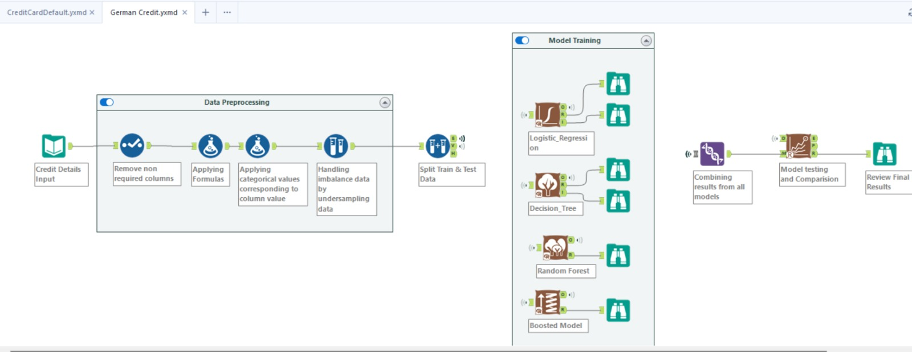
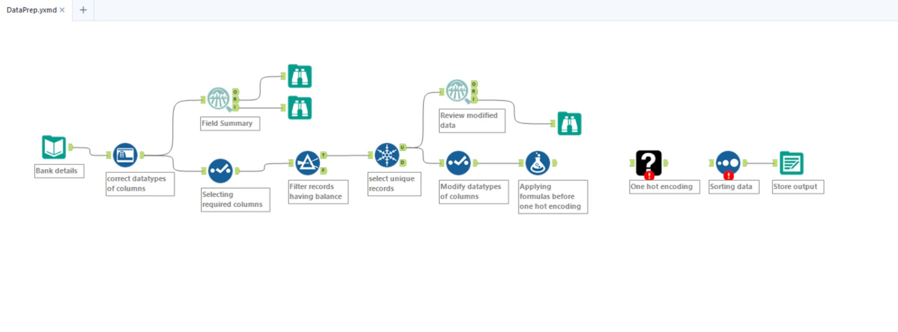

## Introduction

German Credit,DataPrep, Clustering,Credit Card Default are Alteryx workflows created for processing
bank details. This workflow is designed to perform various data processing tasks such as data cleaning, 
transformation, and analysis.

## Software Requirements

To run this workflow, you need to have Alteryx Designer installed on your machine.
Alteryx Designer is a Windows-based application and does not natively support macOS or Linux.
However, it can be run on macOS using a virtual machine or a dual-boot setup.

## Configuration

To configure this workflow, you need to:

1. Open Alteryx Designer.
2. Click on `File > Open Workflow`.
3. Navigate to the location of the `<Workflow Name>` file and click `Open`.
4. Once the workflow is open, you can configure the individual tools by clicking on them and adjusting the settings in the Configuration window.

## Running the Workflow

To run the workflow:

1. Click on the `Run` button in the toolbar at the top of the Alteryx Designer window.
2. The workflow will then execute, and you can monitor its progress in the Results window.

## Loading the Workflow

To load the workflow:

1. Open Alteryx Designer.
2. Click on `File > Open Workflow`.
3. Navigate to the location of the `<Workflow Name>` file and click `Open`.

Please note that the workflow requires specific datasets to be in the same directory as the 
`Workflow` file. If the dataset is in a different location, you will need to update the File Input tool
in the workflow to point to the correct location.

# Alteryx Workflow Overview
 German Credit - Also a part Banking and Financial Services Starter kit by Alteryx
## Data Preprocessing
- **Credit Details Input**: Initial input of credit-related data. (German_credit.jpeg)
- **Remove Rows Not Required Columns**: Cleansing of unnecessary information from the dataset.
- **Applying Business Logic/Rules**: Implementation of specific business rules or logic tailored to requirements.
- **Handling Missing Values/Interpreting Data**: Addressing missing entries in data and interpreting it for further processing.

## Model Training
- **Split Data into Train & Test**: Division of dataset into training and testing sets for model evaluation.
- **Decision Tree**: A machine learning model focused on using decision trees for prediction.
- **Random Forest**: An ensemble learning method combining multiple decision trees.
- **Boosted Model**: Another machine learning model, likely using gradient boosting.

## Model Comparison
- Results from all three models are compared to select the best predictive model.

# Alteryx Workflow Overview -2
Input - Bank.csv

## Data Preprocessing
- **Bank Details**: Initial input data containing banking transactions, customer profiles, or financial information.
- **Correct Datatypes of Columns**: Ensures appropriate data types (numeric, text, date) for each column.
- **Selecting Rows Having Balance**: Filters rows based on balance criteria (e.g., positive balance).
- **Formulas Before One-Hot Encoding**: Creates calculated columns using formulas (e.g., interest rates, binary flags).
- **One-Hot Encoding**: Converts categorical variables into binary columns.
- **Sorting Data**: Arranges data in a specific order.
- **Store Output**: Saves processed data.

## Business Context
- **Use Case**: Credit risk assessment, customer segmentation, interest rate calculation.
- **Impact**:
  - Improved risk assessment.
  - Enhanced customer analysis.
  - Efficient data handling.

